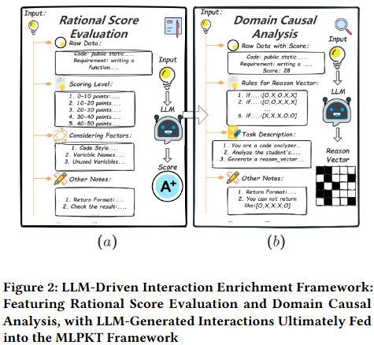
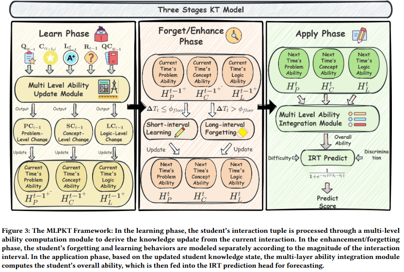

# MIE-MLPKT
This repository is built for the paper MIE+MLPKT: Leveraging LLM and Multiscale Knowledge States to Improve Knowledge Tracing in Programming Tasks.

## Reproduce
To run the complete code, please first download the "data" profile available at: https://drive.google.com/drive/folders/1jdoNIi4GNeYeps6R3tCDsz3GAaEP7KK6?usp=drive_link. It should be noted that, as the paper has not yet been officially accepted, we have currently only open-sourced the labeled dataset of the deepseek-V3.1 version for Code-S, along with the first 5,000 ratings and reasoning extraction data from each dataset. Once the paper is successfully published, we will immediately open-source the complete data.

To further facilitate the reproduction of our work and due to file size limitations (≤25MB), we have provided the first 5,000 interactions of the deepseek V30 version for the Code-S dataset (please note that both the scores and reasoning analysis are results from Deepseek-V30). After downloading this project, simply follow these steps to run the code properly:
1. Prepare the requirements illustrated in the "requirements.txt"
2. Create a directory named "MLKT4" under the "data/Code-S" path.
3. Run "data_save_Code_S&F.py" - this will generate the corresponding training, validation, and test files in the newly created directory.
4. Execute "train_mlkt4" to start running the program!

## Overview
This paper highlights three unique characteristics of programming knowledge tracing tasks compared to traditional subject-based knowledge tracing, which often lead to suboptimal performance of existing KT models on programming benchmarks. To address these challenges, we propose the MIE+MLPKT framework. The MIE component uses carefully designed prompts to extract reasonable scoring labels and multi-level error cause analyses from large language models (LLMs), mitigating label continuity and irrationality issues while reducing high uncertainty. To handle the multi-layered nature of student proficiency in programming tasks, we introduce MLPKT, a three-tiered knowledge tracing framework that integrates error analysis vectors from MIE. Extensive experiments across three datasets and 18 baselines validate the effectiveness of our framework. In future work, we aim to evaluate MIE+MLPKT in real-world educational settings.

## MIE Framework
As illustrated in Figure 2, we design an LLM-Driven Interaction Enrichment Framework to provide reasonable score labels and code analysis results for the three-level knowledge tracing framework. 

  

### Rational Score Evaluation
To adapt the labels in programming datasets for knowledge tracing models, for the code $m_t^i \in \mathcal{M}$ submitted by student $S_i$ at time step $t$, with corresponding ID $\hat{m}_t^i$ and problem description $PD_t^i$, we design a scoring prompt denoted as $P^{\text{s}}$ to obtain the code score at this time step. As shown in Figure 2(a), it mainly includes the inherent data in the dataset ($\rm Data$), namely the student's code $m_t^i$ along with its corresponding ID $\hat{m}_t^i$ and the problem stem $PD_t^i$, scoring criteria with 5 levels ($\rm Level$), factors to consider during the scoring process ($\rm Factors$), and other notes ($\rm Notes$), such as the return format, etc. The entire process can be represented as:

$$ \hat l^i_t = \text{LLM}(P^{\text{s}}(\text{Data}(m^i_t \mid PD^i_t \mid \hat{m}^i_t) \mid \text{Level} \mid \text{Factors} \mid \text{Notes})), \forall S_i \in \mathcal S $$

where $\mid$ represents combination and $\hat l^i_t \in \hat{\mathcal L}$. At this point, we have obtained the set of scores generated by LLM $\hat{\mathcal L}$.

### Domain Causal Analysis
As shown in Figure 2(b), to mitigate the impact of noise arising from high uncertainty in programming tasks on the assessment of students' knowledge states, for student $S_i$ who submits code $m_t^i \in \mathcal{M}$ at time step $t$, along with its corresponding ID $\hat{m}_t^i$, problem description $PD_t^i$, and the code score $\hat{l}_t^i$ obtained from the previous step, we design a reasoning prompt $P^r$ to guide the LLM in inferring the correctness at the logical level and the correctness or error causes at the syntactic level. The resulting analysis is encoded using a 5-dimensional binary vector $R_t^i$ as follows:

- First dimension: Logical correctness.
- Second dimension: Syntactic correctness.
- Third dimension: Syntactic errors due to carelessness.
- Fourth dimension: Syntactic errors due to insufficient proficiency.
- Fifth dimension: Logical errors.

For example, if the LLM determines that the submitted code $m_t^i \in \mathcal{M}$ is logically correct but contains syntactic errors due to carelessness (e.g., unclosed parentheses), the returned vector is $R_t^i = [1, 0, 1, 0, 0]$. In another example, if errors occur in both logical and syntactic aspects, the returned vector is $R_t^i = [0, 0, 0, 1, 1]$. The aforementioned process can be formally expressed as:

$$ R^i_t = \text{LLM}(P^r(\text{Data}(m_t^i \mid \hat{m}_t^i \mid PD_t^i \mid \hat{l}_t^i) \mid \text{Rules} \mid \text{Desc} \mid \text{Notes})), \forall S_i \in \mathcal S $$

where $R^i_t \in \mathcal R$. Thus, we obtain the collection of code analyses $\mathcal R$ as mentioned earlier.

## MLPKT Framework
We divide the learning process into three phases: learning, forgetting/enhancement, and application, while tracing abilities across three levels: syntax, logic, and problem-specific.

- Learning phase: The student's submitted problem, related concepts, and scores are input into a multi-level ability computation module to calculate changes in students' abilities at logic, syntax, and problem-specific levels. For problem-specific ability changes, we design an exponential enhancement function to model the gradual deepening of understanding during repeated attempts. Based on LLM-extracted syntax and logic errors or correctness, we determine the direction of changes in logic and syntax abilities.
- Forgetting/enhancement phase: This phase dynamically selects enhancement or forgetting based on interaction intervals. For interactions with intervals below a threshold, a short-interval enhancement module simulates the learning process; for intervals exceeding the threshold, a long-interval forgetting module simulates the forgetting process.
- Application phase: Syntax, logic, and problem-specific abilities related to the current problem are input into a multi-level student ability application module to predict the student's score. To enhance model interpretability, we design a multi-level ability integration module that makes it applicable to the 2-parameter item response theory (IRT).

  

